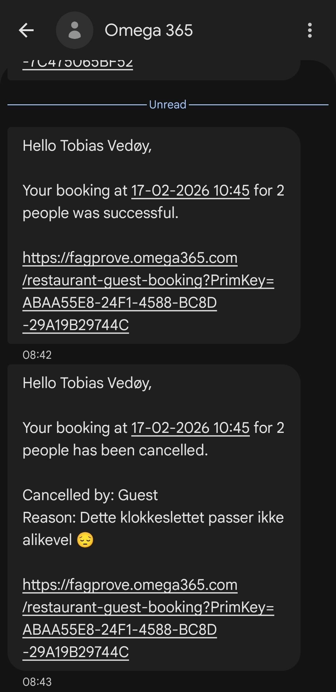
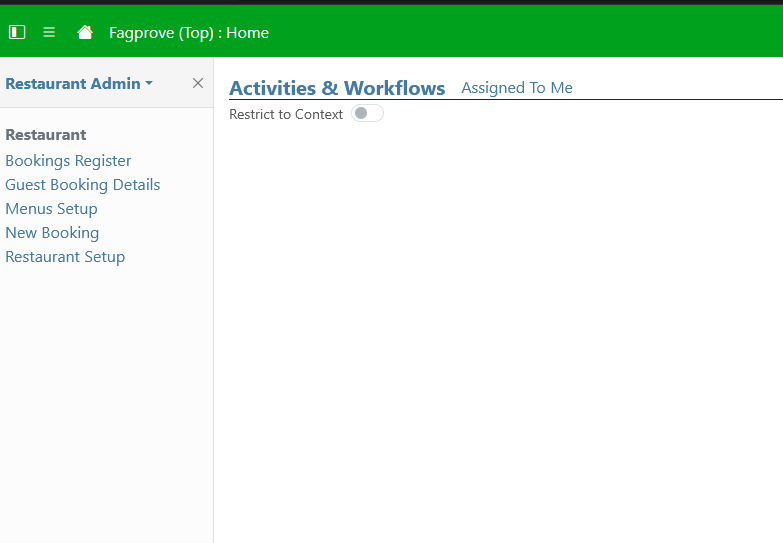
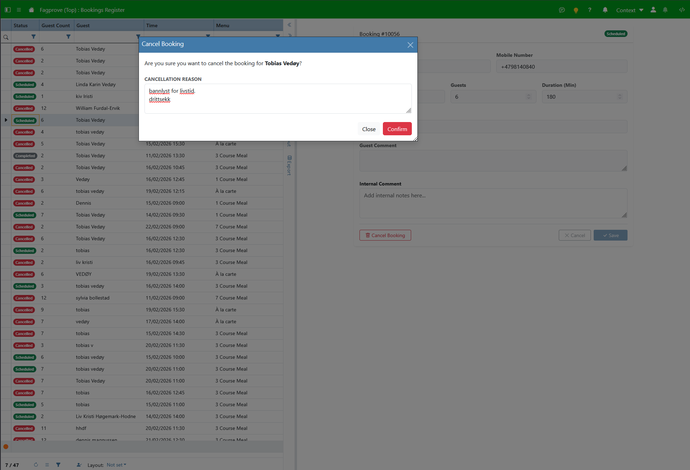
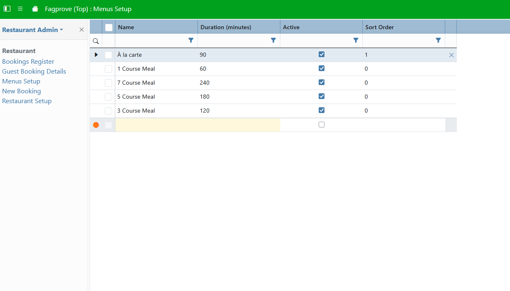

# Brukerdokumentasjon
## Kunde brukerdokumentasjon

    
Hvordan reservere et bord?

    

        For å lage ny reservasjon så kan man gå på <a href="https://fagprove.omega365.com/nt/restaurant-new-booking">denne nettsiden</a>. Her velger du hvor mange gjester som skal være med, hvilken meny du skal ha, og dato og klokkeslett for reservasjonen. Deretter får du opp et skjema der du legger inn navn og telefonnr. (og eventuelle kommentarer) og trykker "Submit" for å opprette reservasjonen.
    

     

    
Hvordan vet jeg om det er fullt?

    

        Når du velger klokkeslettet for reservasjonen din, så vises det på klokkeslettene om det er fullt ved at knappen blir grå, og det er en rød sirkel der det står "Full". Om knappen er oransje, vil det si at hvis du booker til dette klokkeslettet, så får du ikke den fulle varigheten av menyen du har bestilt. Du kan se hvor lang tid du får i den oransje sirkelen i hjørnet på knappen. 
    

     

    
Hvordan motta bekreftelse på SMS?

    

        Når reservasjonen er lagret i systemet, vil du automatisk motta en SMS-bekreftelse på telefonnummeret du oppga. Denne inneholder detaljer om tidspunkt, og en lenke til oversikt av reservasjonen din der du kan se mer informasjon som f.eks. varighet på reservasjonen eller eventuelle kommentarer.
        Du får også SMS bekreftelse ved kansellering av reservasjonen.
    

     

    
Hvordan kansellere min reservasjon?

    

        Du kan kansellere reservasjonen din ved å trykke på lenken du har motatt på SMS i reservasjonsbekreftelsen. Deretter kan du trykke på den røde knappen der det står "Cancel Booking". Når du trykker på denne, vil det åpnes et vindu der du kan oppgi årsak til kansellasjonen, og bekrefte kansellasjonen. 
    

     

## Restaurant brukerdokumentasjon

    
Hvordan logge inn på restaurant-visningen?

    

        For å se alle reservasjoner må du logge inn med Microsoft eller Omega 365 konto på  <a href="https://fagprove.omega365.com">Omega</a>. Der vil du med en gang få opp en innloggingsskjerm
    

     

    
Hvordan se oversikt over alle bookinger?

    

        Når du er logget inn, vil du ankomme fremsiden. Du vil også kunne se de ulike appene ang. reservasjonssystemet i sidemenyen til venstre. Om du velger "Bookings Register" her, vil du ankomme oversikten over reservasjonene, der du kan se og administrere reservasjoner.
    

     
     

    
Hvordan kansellere en reservasjon for en kunde?

    

        Dersom en kunde ringer inn for å kansellere, kan du finne vedkommende i reservasjonsoversikten og trykke på "Kanseller"-knappen i detaljer menyen. Dette vil frigjøre plassene i systemet umiddelbart.
    

     

    
Hvordan fungerer de ulike meny-tidene?

    

        Systemet beregner automatisk varigheten på bordet basert på kundens valg: 
        <ul>
            <li><b>1-retters:</b> 1 time</li>
            <li><b>3-retters:</b> 2 timer</li>
            <li><b>5-retters:</b> 3 timer</li>
            <li><b>7-retters:</b> 4 timer</li>
            <li><b>À la carte:</b> 1t 30m</li>
        </ul>
        Meny tidene kan endres i "Menus Setup" appen som ligger i sidemenyen. Her kan du bestemme varighet og navn på menyen. 
    
 
     

    
Hvor kan jeg justere hvor mange kunder det er plass til?

    

        Dette kan justeres i "Restaurant Setup" i sidemenyen. Her kan du også endre åpningstid og lignende verdier.
    
 
    

