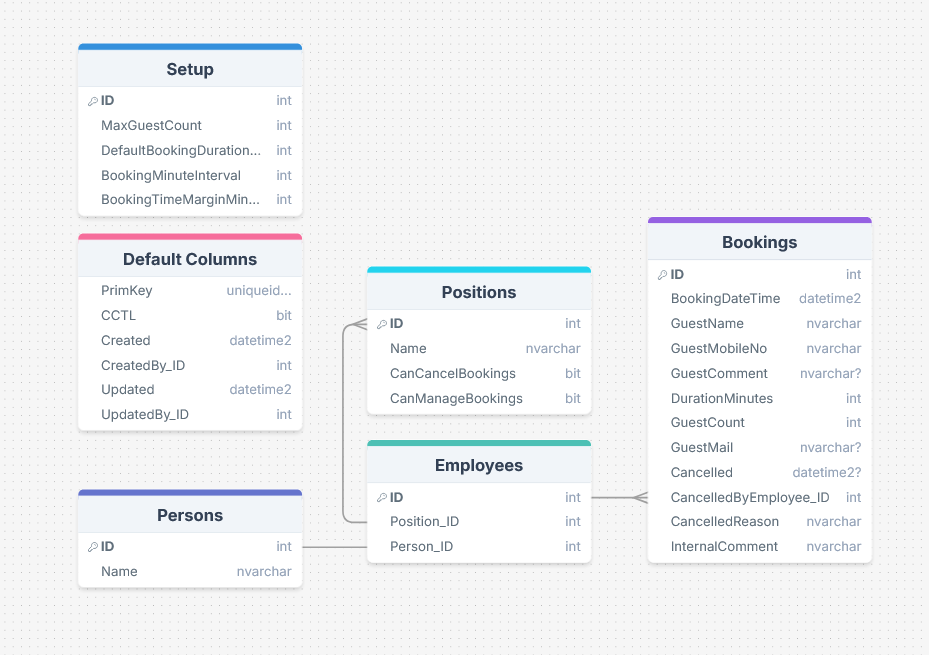
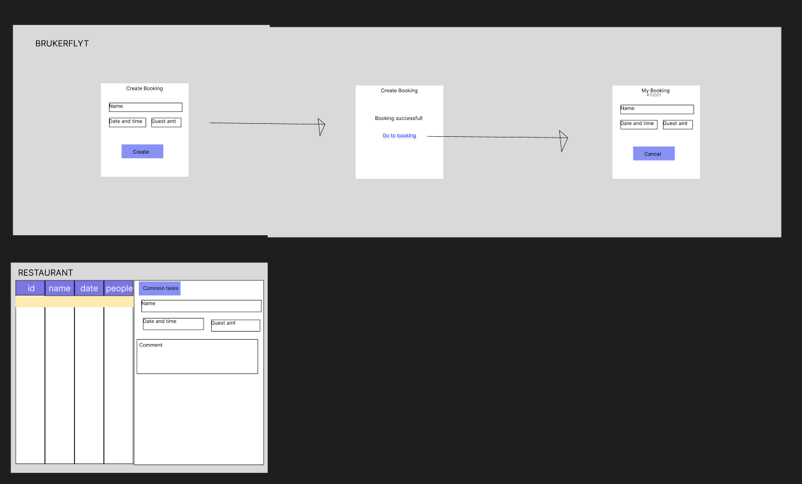

# Fagprøve plan
05/02/2026 - 13/02/2026

## Krav til oppgaven

### Nødvendige krav
 - Bruker/gjest må kunne
   - Opprette reservasjon
     - Tidspunkt
     - Antall gjester (1-12 max)
     - Valgfri kommentar
     - Navn + tlfnr.
   - Se reservasjon
     - Kvittering/referanse
   - Kansellere reservasjon
  - Restaurant må kunne
    - Se alle reservasjoner
  - System må ha
    - Klient-side for reservasjoner
        - Vue frontend
    - Server-side for databehandling
        - SQL database
    - Sikret API for integrasjon
        - Omega sitt Data API
    - Tilgjengelig og brukervennelig design for både restaurant og gjest
        - Personvern
            - Lagre minst mulig data
            - Tilgangsstyring
        - Dataintegritet
            - Unngå bookinger med total over 12 gjester
                - Totalen beregnes basert på overlappende reservasjoner, inkl. tidsmargin 
        - Responsivt design
            - Støtte både mobil og datamaskin slik at alle brukergrupper kan bruke systemet
        
### Avklaringer/antakelser
 - Kanselleringslogikk
    - Skal ikke kunne kansellere etter booking-start
    - Etter starttidspunkt kan kun restaurant/admin kansellere (om kunden ikke møter opp)
 - Kvittering
    - Mulig å åpne denne fra "Booking fullført" skjerm
 - Bookinglengde
    - Default 2 timer per booking, felt for dette i booking-visning og restaurant kan endre det fra "admin-visning" etter booking er opprettet
 - Tidsmargin mellom kunder
    - Burde legges på 15 min ekstra for å gi tid til å vaske bord etc.
 - Intervall for booking
    - Booking kan bare registreres på intervaller (f.eks. at man bare kan book til hvert 15. min)
 - Cutoff for endring av bookingtidspunkt
    - kan bare endres før booking av gjest, men når som helst av restaurant eller admin
 - Setup-tabell
    - Konfigurerbar løsning
        - Endre maks mengde med gjester (restaurant kan få flere bord e.l.)
        - Endre default booking lengde 
        - Endre intervall for booking
        - Endre tidsmargin mellom kunder

### Nice-to-have (kan gjøres om jeg finner ut at jeg har bedre tid enn forventet)
- Setup kan utvides til å støtte flere domene
    - Systemet kan da utvides til flere restauranter
- Kvittering til booking
    - Sendt på mail/sms med link til app
        - Referanse her burde være GUID sånn at folk ikke kan endre URL og se andres bookinger
- Verifisering med mail/sms for å unngå tull/spam
    - Dette kan da også brukes til at brukeren kan se alle bookingene sine ved å "logge inn" via verifiseringen, og dele bookingen med andre mailer
- Kan utvides med at det kan registreres hva gjestene har, også evt. bruke det til fakturerering
    - Dette hadde vært ekstremt tidskrevende, så jeg er tvilsom til at jeg får tid til akkurat denne, selv om den virker gøy å utvikle

## Teknologivalg
 - Omega 365 CTP (Core Technology Platform) på grunn av innebygd data API og tilgangstyring. Dette er rammeverket som er brukt i bedriften
    - Vue 3
        - Klient-siden av programmet
        - Gjør struktur av koden enkelt pga. komponentbasert kode
    - Bootstrap 5
        - Brukes i Vue koden for å lage layouts og responsivt design for alle brukergrupper (mobil/datamaskin)
    - Microsoft SQL Server
        - Server-siden av programmet for databehandling 
        - Nødvendig for å lagre bookinger og dataintegritet
    - Data API
        - Enkel og sikker integrasjon mellom server-siden og klient-siden
        - Utviklet av Omega
        - Trygt mot SQL injection
 - Github
    - Dokumentasjon
    - Planlegging
    - Loggføring
 - DrawSQL
    - Skisser for datamodell
 - Figma
    - Skisser for apper/brukergrensesnitt

## Fremgangsmåte
 - Jeg begynner med å planlegge datamodell og app layout
 - Lage roller og moduler for tilganger til systemet
 - Lage SQL objekter
    - tabeller
        - Setup
            - U/I/D-Trig: standard tilgangssjekk for om du er Manager e.l.
        - Employees
            - U/I/D-Trig: standard tilgangssjekk for om du er Manager e.l.
        - Positions
            - U/I/D-Trig: standard tilgangssjekk for om du er Manager e.l.
        - Bookings
            - ITrig
                - datavalidering
                    - Om det fins overlapp av bookinger der total av kunder blir over maks tilatt -> gi feilmld
                - tilganger
                    - ingen standard tilgangssjekk, pga. at man skal kunne lage booking uten bruker
            - UTrig
                - datavalidering
                    - bare tilatt å endre visse felt, og de kan ikke f.eks endres av gjester etter bookingen har startet
                - tilganger
                    - restauranten skal ha tilattelse til å endre de fleste felter
                    - bruker får bare endre noen få
            - DTrig 
                - stoppes helt. bookingen må enten kanselleres, eller markeres med et felt som jeg senere kan legge til som f.eks. Deleted (DATETIME2) for logging
    - view
        - Bookings
            - joine inn mere informasjon til bookingen, dette kan brukes til f.eks. reservasjonsadministreringsgriden
        - GuestsPerHour
            - view som viser hvilke tider det er gjester og hvor mange, for å sjekke at det ikke blir for mange gjester
    - prosedyrer
        - BookTable
        - SendConfirmationMail
 - Lage layouts for apper i Vue
 - Legge til funksjoner i appen
    - Ny booking visninger for gjester
    - Bookingadministrerings visninger for ansatte
 - Teste + bugfixing
 - Vurdere om jeg har tid til ekstrafunksjonalitet + evt innføring
 - Skrive System dokumentasjon, testrapporter og brukerveiledninger underveis som systemet utvikles 

## Skisser
### Datamodell

 - Default Columns
    - Standard kolonner som blir opprettet automatisk i Omega sitt databaseadministreringsverktøy
 - Setup
    - Konfigurerbare verdier for å tillate restauranten å endre på f.eks. hvor mange gjester de har plass til etc.
 - Persons
    - Systemtabell som fins fra før av i Omega. Alle brukere fins her, utenom gjester, som bare får tilgang til egne apper relatert til å booke et bord uten å måtte ha en person rad
 - Positions
    - Dette er en form for setup-tabell der en admin kan gå inn og legge til stillinger som f.eks. Servitør, og sette det til at de kan kansellere reservasjoner eller endre kommentarer og mengde med gjester
 - Employees
    - Denne tabellen er for å lagre hvilke brukere som er ansatte hos restauranten, og den har foreign key til Persons systemtabellen og Positions tabellen for å si hvilken person det er som er ansatt, og hvilken stilling de har
 - Bookings
    - Her blir alle reservasjonene lagd av gjester lagt inn. Her må det legges inn kundens navn, mobilnr, tidspunkt, og antall gjester, i tillegg til valgfri kommentar. Jeg har også lagt til noen ekstra kolonner for mail og intern kommentar som bare restauranten skal kunne se.

### Grov skisse av appen

 - Her er en del av hvordan jeg forestiller meg UI hadde sett ut

## Tidsskjema
 - Torsdag
    - Gjennomgang av fagprøve og krav (1t)
    - Skrive plandokument og lage skisser (5,5t)
    - Logging (0,25t)
 - Fredag
    - Begynne med databaseobjekter (3,5t)
    - Legge inn testdata (1t)
    - Begynne på app layouts(3t)
    - Logging (0,25t) 
 - Mandag 
    - Endringforslag utredelse og planlegging (2,5t) 
    - Forsette app layouts og videre arbeid på views (7,5t eller 5t om endring kommer)
    - Logging (0,25t)
 - Tirdag
    - Endringforslag utredelse og planlegging (2,5t) 
    - Forsette app layouts og videre arbeid på views (3t)
    - Begynne sql- og applogikk (2t)
    - Logging (0,25t)
 - Onsdag
    - Fullføre endringforslag (2t)
    - Fullføre app layouts og views (2t)
    - Fortsette sql- og applogikk (3,5t)
    - Logging (0,25t)
 - Torsdag
    - Fullføring av sql- og applogikk og eventuell finpussing (5,5t)
    - Begynne å lage presentasjon (2t)
    - Logging (0,25t)
 - Fredag
    - Finpusse presentasjon (1t)
    - Presentere

## Kilder:
  - [ChatGPT](https://chatgpt.com)
  - [Tidligere fagprøvemateriale (github)](https://github.com)
  - Tor Halvorsen Aasheim (faglig leder)
  - Kollegaer
  - [Egon bordbooking](https://booking.gastroplanner.no/egonhaugesund/t)
  - [Figma](https://www.figma.com/)
  - [DrawSQL](https://drawsql.app/)
