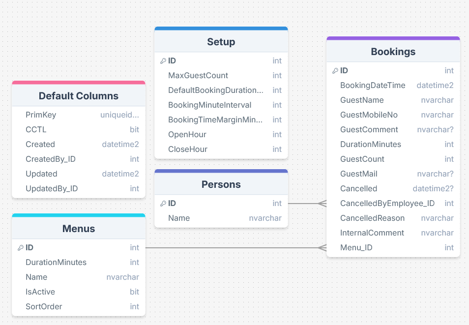

# Systemdokumentasjon
Dette dokumentet beskriver den tekniske oppbyggingen av reservasjonssystemet for Omega Gourmet. Systemet håndterer alt fra kundens bookingforespørsel til restaurantens administrasjon av kapasitet og menyer.

## Innhold
 - Oppsummering av applikasjonen
 - Teknologier
 - Datamodell
 - Sikkerhet og tilgangsstyring
 - Frontend
 - Implementasjon av endringsoppgave
 - Utfordringer
 - Avvik fra opprinnelig plan

    
Oppsummering av applikasjonen

    
 Applikasjonen er et komplett bookingsystem for en restaurant med begrenset kapasitet (12 gjester). Gjester kan reservere bord basert på ulike menyer med ulik varighet, motta SMS-bekreftelse og kansellere via unike lenker basert på Omega sin PrimKey. Restauranten har en oversikt for å se kundebookingene. Det er også apper for å endre innstillinger for kapasitet og administrere menyer. 

    
Teknologier

    <ul>
        <li><b>Omega 365 CTP:</b> Rammeverk for Data API, tilgangsstyring og diverse front-end komponenter i Vue.</li>
        <li><b>Microsoft SQL Server:</b> Database for lagring av reservasjoner, menyer og konfigurasjon.</li>
        <li><b>Vue.js 3 (TypeScript):</b> Frontend-rammeverk for en responsiv, reaktiv og brukervennlig brukeropplevelse.</li>
        <li><b>Bootstrap 5:</b> Brukt for layout og styling</li>
    </ul>

    
Datamodell

     
    
Databasen er bygget for å sikre dataintegritet og sporbarhet.

    <ul>
        <li><b>Bookings:</b> Hovedtabell for reservasjoner, her lagres all informasjon om reservasjonen.</li>
        <li><b>Menus:</b> Inneholder tilgjengelige menyer (f.eks. 3-retters) og deres tilhørende varighet (minutter).</li>
        <li><b>Setup:</b> Setuptabell for maks antall gjester, åpningstider og tidsmarginer.</li>
        <li><b>Persons:</b> Systemtabell i Omega som inneholder alle personer som har tilgang til systemet</li>
    </ul>
    
<b>Views/Definition procs:</b>

    <ul>
        <li><code>aviw_BookingsRegister</code>: Joiner Bookings med Menus og Persons for visning i "Bookings Register" appen</li>
        <li><code>aviw_GuestsPerQuarterHour</code>: View som henter alle kvarter i der det er gjester. Inneholder kolonner for hvor mange gjester som er der, og hvor mye plass det er igjen for hvert kvarter.</li>
        <li><code>astp_GetSetup</code>: Dette er en definition proc som henter setup data til å bli brukt i appene som gjester bruker. Denne setter session context propertyen 'BOOKING_ANONYMOUS' til 1 for å gå gjennom sikkerhetssjekken til Setup-tabellen</li>
        <li><code>astp_BookingsDefinition</code>: Dette er en definition proc som tar inn PrimKey som parameter. Den henter bookingen med den PrimKeyen. Den setter session context propertyen 'BOOKING_ANONYMOUS' til 1 for å gå gjennom sikkerhetssjekken til Bookings-tabellen. Den har også et kalkulert felt for BookingEndDateTime og joiner med Menus tabellen for å hente MenuName. Den blir brukt i guest-booking appen for å hente data om en booking.</li>
        <li><code>astp_MenusDefinition</code>: Dette er en definition proc som henter data for Menyer til å bli brukt i appene som gjester bruker. Denne setter session context propertyen 'BOOKING_ANONYMOUS' til 1 for å gå gjennom sikkerhetssjekken til Menus-tabellen.</li>
    </ul>
    
<b>Prosedyrer:</b>

    <ul>
        <li><code>astp_CreateBooking</code>: Dette er prosedyren som kjøres når en bruker trykker "Submit" i new-booking appen. Den setter session context propertyen 'BOOKING_ANONYMOUS_INSERT' til 1 for å gå gjennom tilgangssjekken i trigger. Den kjører også astp_SendBookingCreatedSMS som en jobb for å gå gjennom tilgangssjekken til systemtabellen stbl_SMS_Messages</li>
        <li><code>astp_CancelBooking</code>: Dette er prosedyren som kjøres når en gjest kansellerer reservasjonen sin. Den setter session context propertyen 'BOOKING_ANONYMOUS_UPDATE' til 1 for å gå gjennom tilgangssjekken i trigger. Den kjører også astp_SendBookingCancelledSMS som en jobb for å gå gjennom tilgangssjekken til systemtabellen stbl_SMS_Messages</li>
        <li><code>astp_CancelBookingEmployee</code>: Dette er prosedyren som kjøres når restauranten kansellerer reservasjonen til en gjest. Denne går gjennom tilgangssjekken normalt, for å kontrollere at brukeren har tilgang i "Restaurant Admin" modulen. Den kjører også astp_SendBookingCancelledSMS, men direkte, for at brukeren burde ha tilgang til SMS systemtabellen</li>
        <li><code>astp_SendBookingCreatedSMS</code>: Dette er prosedyren som blir brukt til å sende SMS-bekreftelse til gjesten når de oppretter reservasjon. Den ligger også som jobb slik at når en gjest (uten konto) booker et bord, så blir denne prosedyren kjørt i JobsContext istedet for AnonymousContext</li>
        <li><code>astp_SendBookingCancelledSMS</code>: Dette er prosedyren som blir brukt til å sende SMS-bekreftelse til gjesten når de kansellerer reservasjonen sin. Den ligger også som jobb slik at når en gjest (uten konto) booker et bord, så blir denne prosedyren kjørt i JobsContext istedet for AnonymousContext</li>
    </ul>

    
Sikkerhet og Tilgangsstyring

    
Løsningen benytter Omega 365s rollebaserte sikkerhetsmodell:

    <ul>
        <li>
            <b>Anonymous Access:</b> Gjester må ha tilgang til å kunne kjøre diverse prosedyrer og views som nevt over, og å kunne se sin egen spesifikke reservasjon via en unik GUID (som hindrer ID-guessing). Dette er gjort ved å inserte navn på databaseobjektene inn i stbl_WebSiteCMS_AnonymousAccess tabellen, slik at man ikke blir redirectet til login siden med en gang man går inn på new-booking appen
        </li>
        <li>
            <b>Restaurant Admin:</b> Full tilgang til administrasjonsapper og setuptabeller.
        </li>
        <li>
            <b>Restaurant Booking:</b> Full tilgang til å kunne se booking register.
        </li>
        <li>
            <b>Sikkerhet i databasen:</b>
            Bruk av triggere og table-views (atbv) i 365 CTP for å validere tilganger/session context til den som gjør CRUD aksjoner mot databasen.
        </li>
    </ul>

    
Frontend

    
Systemet er delt inn i tre hovedmoduler:

    <ol>
        <li><b>Booking-klient:</b> En steg-for-steg veiviser for gjester. Bruker reaktive komponenter for å vise ledige tidspunkter, og dynamisk la brukeren velge mellom menyer.</li>
        <li><b>Bookings Register:</b> En administrativ oversikt for ansatte med filtrering og kanselleringsmuligheter.</li>
        <li><b>Setup Apps:</b> Egne apper for å endre restaurantens parametere (hvor mange gjester det er plass til, menyer osv..).</li>
    </ol>

    
Implementasjon av endringsoppgave (Meny-logikk)

    
 Den største endringen fra planen var innføringen av dynamisk varighet. Dette ble løst ved å: 
    <ol>
        <li>Legge til Meny-tabellen</li>
        <li>Lage setup app for Menyer</li>
        <li>Legge til egen skjerm for valg av meny i ny booking appen</li>
        <li>Oppdatere Chooser-komponenten for tidsspunkt til å kunne ta i mot dynamisk varighet. </li>
        <li>Jeg tok også å la til funksjonen for å kunne ha bookinger med mindre varighet enn det som egenlig er i menyen, for å tilrettelegge til at man kan fylle inn små åpne vinder om gjesten vil det. </li>
    </ol>
    
 

    
Utfordringer og Problemløsning

    <ul>
        <li>
            <b>Sikkerhet ved anonym bruk:</b> 
            En hovedutfordring var å tillate gjester uten brukerkonto å interagere med databasen (opprette booking/sende SMS) uten å åpne sikkerhetshull. 
            <i>Løsning:</i> Jeg løste dette ved å bruke <code>SESSION_CONTEXT</code>-flagg som triggerne validerer, samt å kjøre SMS-utsending som bakgrunnsjobber. Dette sikrer at anonyme brukere kun kan utføre strengt definerte operasjoner.
        </li>
        <li>
            <b>Dynamisk tid og kapasitet:</b> 
            Innføringen av menyer med ulik varighet gjorde kapasitetsberegningen kompleks. Det holdt ikke lenger å sjekke starttidspunktet; man måtte sjekke hele varigheten av måltidet.
            <i>Løsning:</i> Jeg utviklet viewet <code>aviw_GuestsPerQuarterHour</code> som regnet ut hvor mange ledige plasser det er per 15. minutt. Dette gjorde det mulig for frontend å validere hele tidsrommet for den valgte menyen før man kan gå videre, for en mye bedre brukeropplevelse
        </li>
        <li>
            <b>Sikring av gjestelenker:</b> 
            For å unngå at gjester kunne se andres bookinger ved å endre tall i URL-en, måtte jeg sikre tilgangen til reservasjonsvisningen.
            <i>Løsning:</i> Jeg tok i bruk Omega sin PrimKey kolonne som er en GUID for alle eksterne lenker. Ved å bruke en definition proc som kun slår opp på denne unike nøkkelen, sikret jeg at personopplysninger er utilgjengelige for uvedkommende.
        </li>
    </ul>

    
Avvik fra plan

    <ul>
        <li><b>Menyvalg:</b> Opprinnelig plan var fast 2 timers varighet. Avviket ble gjort for å støtte endringsoppgaven om menyer.</li>
        <li><b>SMS-integrasjon:</b> Lagt til som en forbedring for bedre brukeropplevelse (Nice-to-have i planen som ble prioritert), men også som en form for forsikring på at jeg oppfylte kravet som at gjester skal ha mulighet for å se reservasjonene sine.</li>
    </ul>

