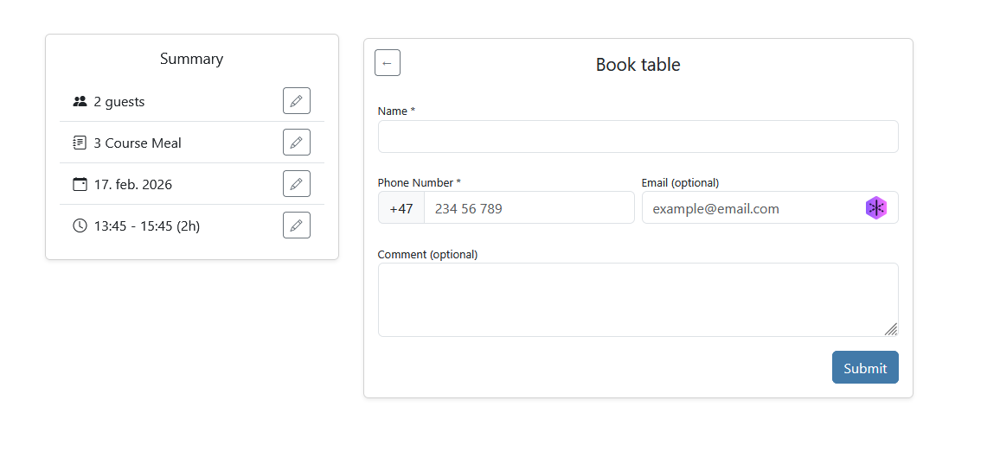
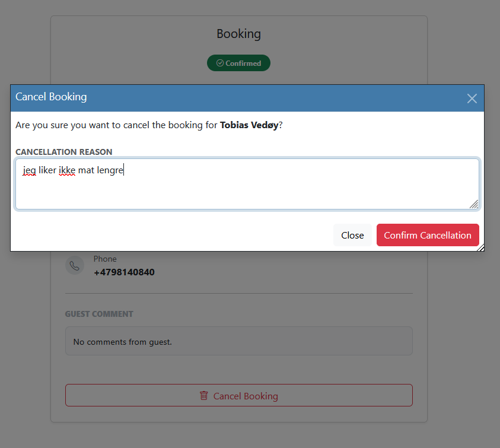
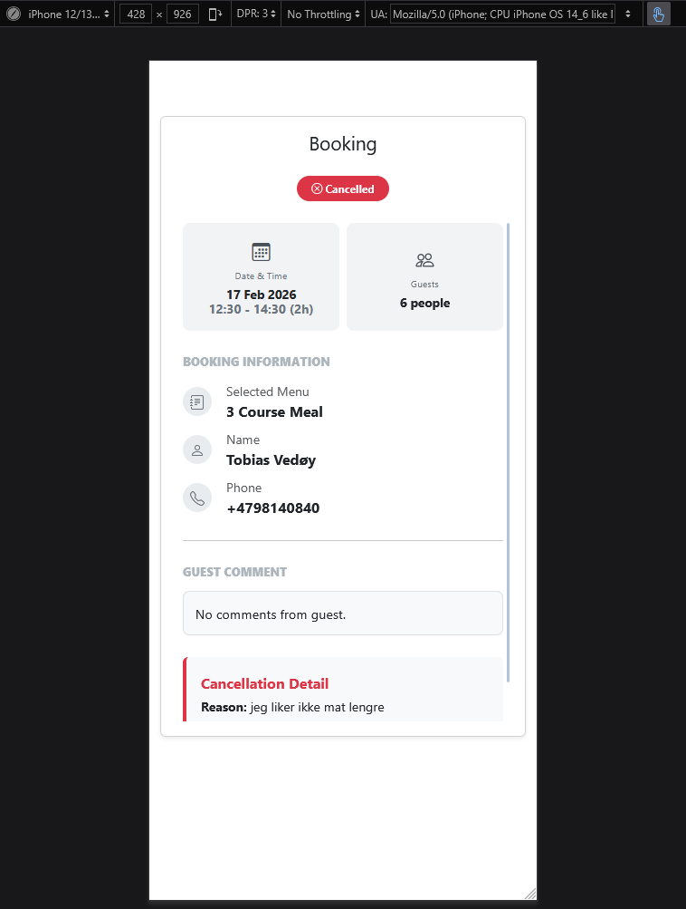
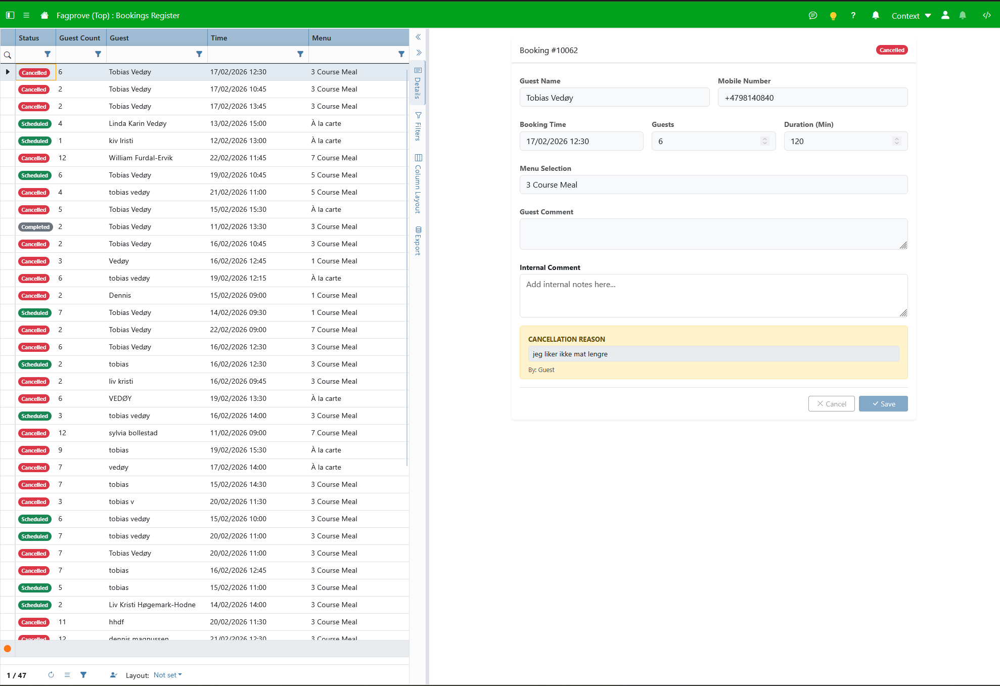
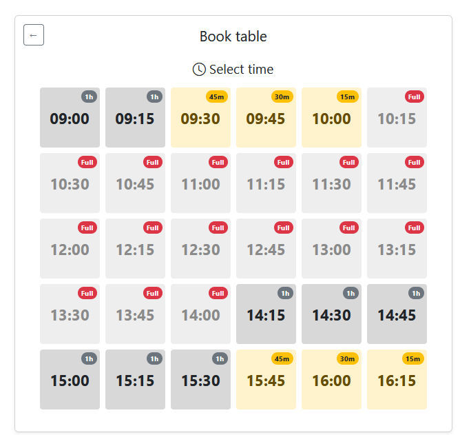
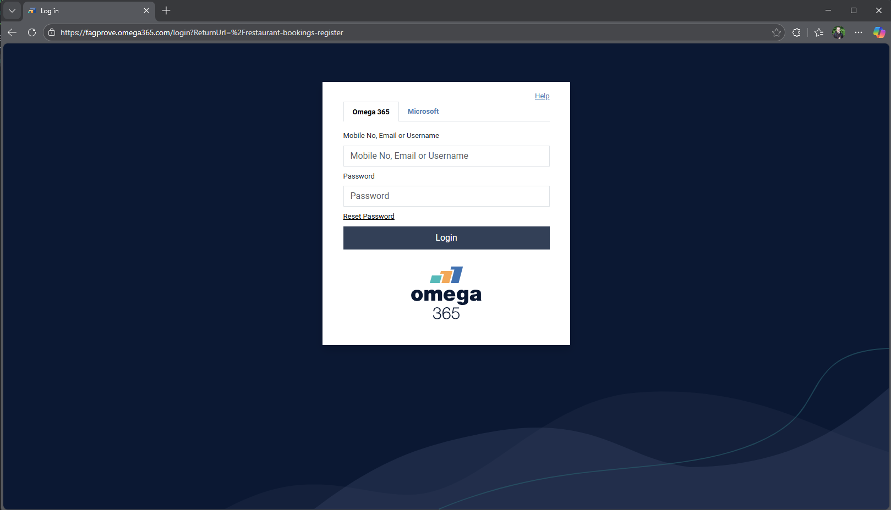

# Test Rapport

## Plan:
### Innledning og Teststrategi
 - Hensikten med testen er å verifisere at alle krav i oppgavebeskrivelsen er møtt, med spesielt fokus på brukervennlighet, dataintegritet (maks 12 gjester), dynamisk tidsberegning basert på menyvalg og sikkerhet.

### Testmetoder:
 - Manuell funksjonstest: Verifisere knapper, skjemaer og navigasjon.
 - Grenseverdianalyse: Teste logikken for "Full restaurant"
 - Sikkerhetstest: Sjekke at API-endepunkter krever autorisasjon for restaurant-visning og at bruker-visning

## Funksjonell testing
### Booking-visning (kunde-side)
<table>
    <thead>
        <tr>
            <th>Funksjon</th>
            <th>Forventet oppførsel</th>
            <th>Faktisk Resultat</th>
            <th>Bilde</th>
            <th>Eventuelle fikser</th>
            <th>Status</th>
        </tr>
    </thead>
    <tbody>
        <tr>
            <td><b>Opprette reservasjon med menyvalg</b></td>
            <td>Kunde kan fylle ut navn, tlf, antall gjester, og velge meny og tidspunkt</td>
            <td>Kunde får fylt ut alle felt inkludert spesifisert menyvalg.</td>
            <td></td>
            <td></td>
            <td>✅</td>
        </tr>
        <tr>
            <td><b>Validering av input</b></td>
            <td>Systemet nekter innsending hvis navn eller tlf mangler.</td>
            <td>Systemet tillater ikke innsending hvis navn eller tlf mangler.</td>
            <td></td>
            <td></td>
            <td>✅</td>
        </tr>
        <tr>
            <td><b>Se egne reservasjoner</b></td>
            <td>Kunden får SMS om reservasjonene sine, enten ved oppretting eller kansellering.</td>
            <td>Kunden får SMS om reservasjonene sine, ved både oppretting og kansellering.</td>
            <td></td>
            <td></td>
            <td>✅</td>
        </tr>
        <tr>
            <td><b>Kansellere reservasjon</b></td>
            <td>Kunden kan kansellere reservasjonen sin.</td>
            <td>Kunden får kansellert reservasjonen sin.</td>
            <td></td>
            <td></td>
            <td>✅</td>
        </tr>
        <tr>
            <td><b>Responsivt design</b></td>
            <td>Nettsiden fungerer og ser bra ut på mobilskjerm.</td>
            <td>Appen har responsivt design og funksjonalitet er bevart på forskjellige brukergrensesnitt.</td>
            <td></td>
            <td></td>
            <td>✅</td>
        </tr>
    </tbody>
</table>

### Admin-visning (restaurant-side)
<table>
    <thead>
        <tr>
            <th>Funksjon</th>
            <th>Forventet oppførsel</th>
            <th>Faktisk Resultat</th>
            <th>Bilde</th>
            <th>Eventuelle fikser</th>
            <th>Status</th>
        </tr>
    </thead>
    <tbody>
        <tr>
            <td><b>Oversikt over bookinger</b></td>
            <td>Admin kan se en liste over alle reservasjoner med detaljer.</td>
            <td>Admin kan se en liste over alle reservasjoner med detaljer.</td>
            <td></td>
            <td></td>
            <td>✅</td>
        </tr>
        <tr>
            <td><b>Kansellere reservasjon</b></td>
            <td>Restauranten kan kansellere en booking fra systemet.</td>
            <td>Restauranten kan kansellere en booking fra systemet.</td>
            <td></td>
            <td></td>
            <td>✅</td>
        </tr>
    </tbody>
</table>

### Systemlogikk, sikkerhet og kapasitet
<table>
    <thead>
        <tr>
            <th>Test-case</th>
            <th>Forventet oppførsel</th>
            <th>Faktisk Resultat</th>
            <th>Bilde</th>
            <th>Eventuelle fikser</th>
            <th>Status</th>
        </tr>
    </thead>
    <tbody>
        <tr>
            <td><b>Maks kapasitet (12stk)</b></td>
            <td>Systemet stopper booking dersom totalt antall gjester overstiger 12.</td>
            <td>Systemet stopper booking dersom totalt antall gjester overstiger 12 både i frontend (klokkeslett vises som utilgjengelige) og i SQL (gir feilmelding i trigger)</td>
            <td></td>
            <td></td>
            <td>✅</td>
        </tr>
        <tr>
            <td><b>Admin-tilgang</b></td>
            <td>Kun tilatte brukere kan se admin-visning, men alle kan se "ny booking"-visningen</td>
            <td>Kun tilatte brukere kan se admin-visning, men alle kan se "ny booking"-visningen</td>
            <td></td>
            <td></td>
            <td>✅</td>
        </tr>
    </tbody>
</table>
